### Escuela Colombiana de Ingeniería

### Arquitecturas de Software - ARSW

### Brayan Burgos - Daniel Varón

## Escalamiento en Azure con Maquinas Virtuales, Sacale Sets y Service Plans

### Dependencias

* Cree una cuenta gratuita dentro de Azure. Para hacerlo puede guiarse de
  esta [documentación](https://azure.microsoft.com/en-us/free/search/?&ef_id=Cj0KCQiA2ITuBRDkARIsAMK9Q7MuvuTqIfK15LWfaM7bLL_QsBbC5XhJJezUbcfx-qAnfPjH568chTMaAkAsEALw_wcB:G:s&OCID=AID2000068_SEM_alOkB9ZE&MarinID=alOkB9ZE_368060503322_%2Bazure_b_c__79187603991_kwd-23159435208&lnkd=Google_Azure_Brand&dclid=CjgKEAiA2ITuBRDchty8lqPlzS4SJAC3x4k1mAxU7XNhWdOSESfffUnMNjLWcAIuikQnj3C4U8xRG_D_BwE)
  . Al hacerlo usted contará con $200 USD para gastar durante 1 mes.

### Parte 0 - Entendiendo el escenario de calidad

Adjunto a este laboratorio usted podrá encontrar una aplicación totalmente desarrollada que tiene como objetivo calcular
el enésimo valor de la secuencia de Fibonnaci.

**Escalabilidad**
Cuando un conjunto de usuarios consulta un enésimo número (superior a 1000000) de la secuencia de Fibonacci de forma
concurrente y el sistema se encuentra bajo condiciones normales de operación, todas las peticiones deben ser respondidas
y el consumo de CPU del sistema no puede superar el 70%.

### Parte 1 - Escalabilidad vertical

1. Diríjase a el [Portal de Azure](https://portal.azure.com/) y a continuación cree una maquina virtual con las
   características básicas descritas en la imágen 1 y que corresponden a las siguientes:
    * Resource Group = SCALABILITY_LAB
    * Virtual machine name = VERTICAL-SCALABILITY
    * Image = Ubuntu Server
    * Size = Standard B1ls
    * Username = scalability_lab
    * SSH publi key = Su llave ssh publica


2. Para conectarse a la VM use el siguiente comando, donde las `x` las debe remplazar por la IP de su propia VM.

   `ssh scalability_lab@xxx.xxx.xxx.xxx`

3. Instale node, para ello siga la sección *Installing Node.js and npm using NVM* que encontrará en
   este [enlace](https://linuxize.com/post/how-to-install-node-js-on-ubuntu-18.04/).
4. Para instalar la aplicación adjunta al Laboratorio, suba la carpeta `FibonacciApp` a un repositorio al cual tenga
   acceso y ejecute estos comandos dentro de la VM:

   `git clone <your_repo>`

   `cd <your_repo>/FibonacciApp`

   `npm install`

5. Para ejecutar la aplicación puede usar el comando `npm FibinacciApp.js`, sin embargo una vez pierda la conexión ssh
   la aplicación dejará de funcionar. Para evitar ese compartamiento usaremos *forever*. Ejecute los siguientes comando
   dentro de la VM.

   `npm install forever -g`

   `forever start FibinacciApp.js`

6. Antes de verificar si el endpoint funciona, en Azure vaya a la sección de *Networking* y cree una *Inbound port rule*
   tal como se muestra en la imágen. Para verificar que la aplicación funciona, use un browser y user el
   endpoint `http://xxx.xxx.xxx.xxx:3000/fibonacci/6`. La respuesta debe ser `The answer is 8`.


7. La función que calcula en enésimo número de la secuencia de Fibonacci está muy mal construido y consume bastante CPU
   para obtener la respuesta. Usando la consola del Browser documente los tiempos de respuesta para dicho endpoint
   usando los siguintes valores:
    * 1000000
      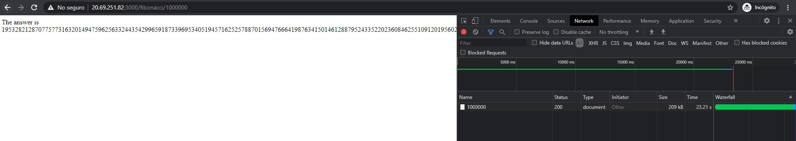
    * 1010000
      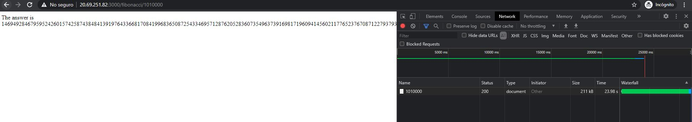
    * 1020000
      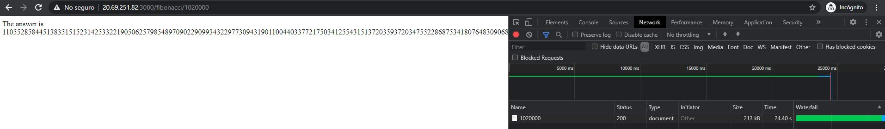
    * 1030000
      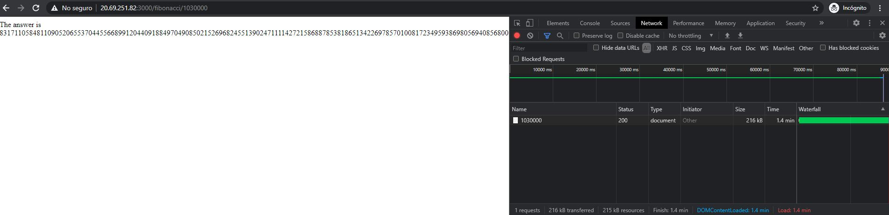
    * 1040000
      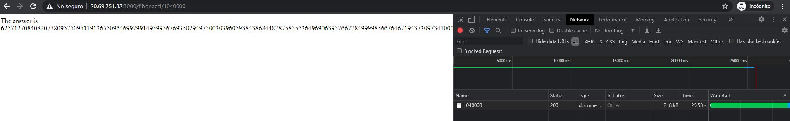
    * 1050000
      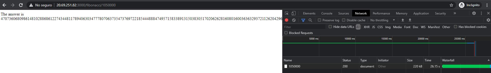
    * 1060000
      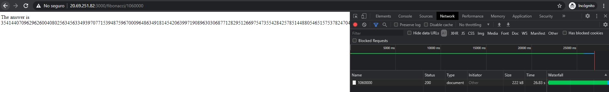
    * 1070000
      
    * 1080000
      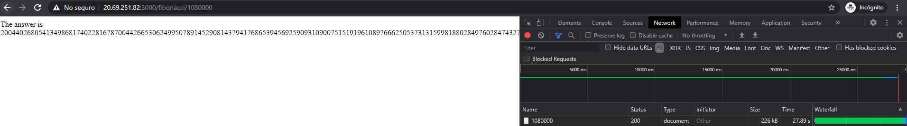
    * 1090000
      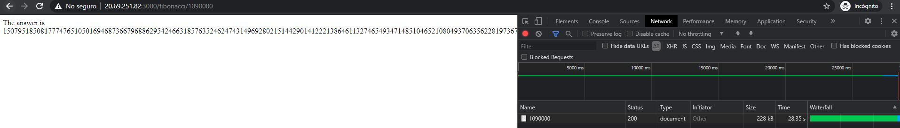

8. Dírijase ahora a Azure y verifique el consumo de CPU para la VM. (Los resultados pueden tardar 5 minutos en aparecer)
   .

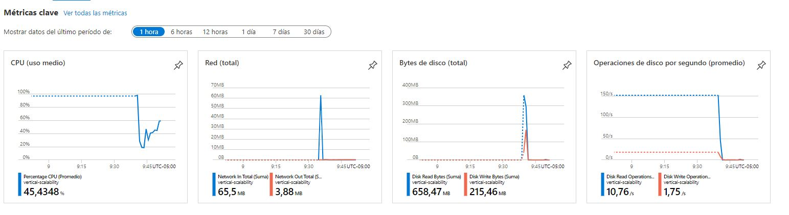

9. Ahora usaremos Postman para simular una carga concurrente a nuestro sistema. Siga estos pasos.
    * Instale newman con el comando `npm install newman -g`. Para conocer más de Newman consulte el
      siguiente [enlace](https://learning.getpostman.com/docs/postman/collection-runs/command-line-integration-with-newman/)
      .
    * Diríjase hasta la ruta `FibonacciApp/postman` en una maquina diferente a la VM.
    * Para el archivo `[ARSW_LOAD-BALANCING_AZURE].postman_environment.json` cambie el valor del parámetro `VM1` para
      que coincida con la IP de su VM.
    * Ejecute el siguiente comando.

    ```
    newman run ARSW_LOAD-BALANCING_AZURE.postman_collection.json -e [ARSW_LOAD-BALANCING_AZURE].postman_environment.json -n 10 &
    newman run ARSW_LOAD-BALANCING_AZURE.postman_collection.json -e [ARSW_LOAD-BALANCING_AZURE].postman_environment.json -n 10
    ```

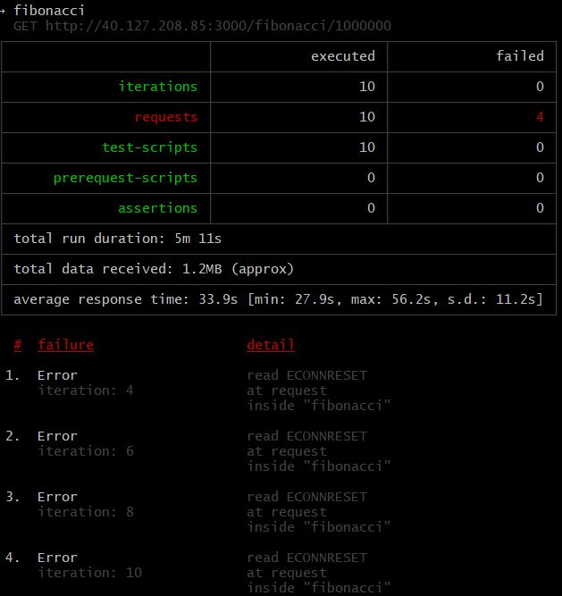
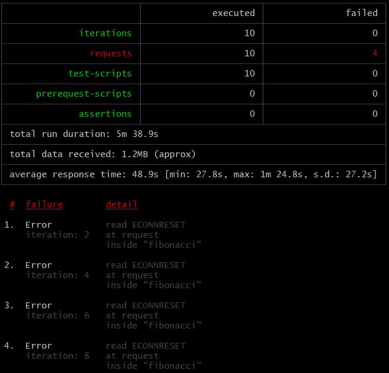

10. La cantidad de CPU consumida es bastante grande y un conjunto considerable de peticiones concurrentes pueden hacer
    fallar nuestro servicio. Para solucionarlo usaremos una estrategia de Escalamiento Vertical. En Azure diríjase a la
    sección *size* y a continuación seleccione el tamaño `B2ms`.


11. Una vez el cambio se vea reflejado, repita el paso 7, 8 y 9.

Paso 7 con Escalamiento vertical:

* 1000000
  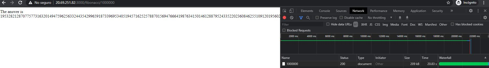
* 1010000
  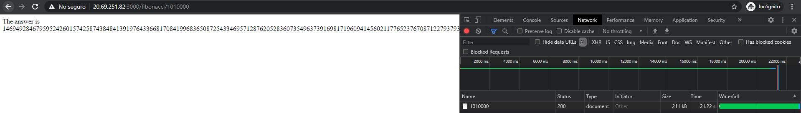
* 1020000
  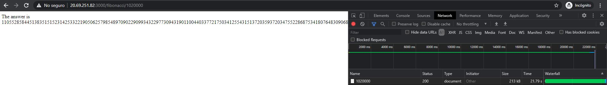
* 1030000
  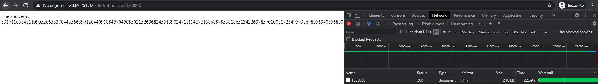
* 1040000
  
* 1050000
  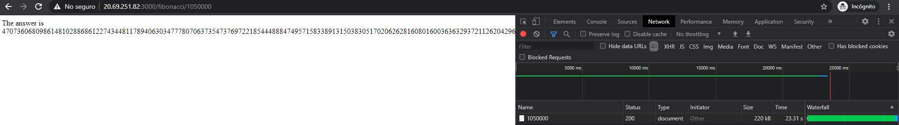
* 1060000
  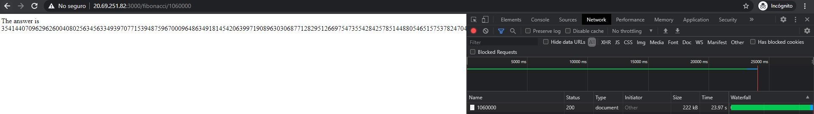
* 1070000
  
* 1080000
  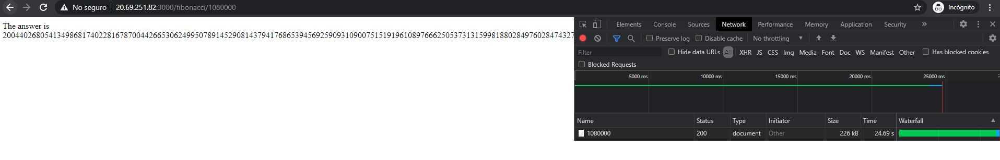
* 1090000
  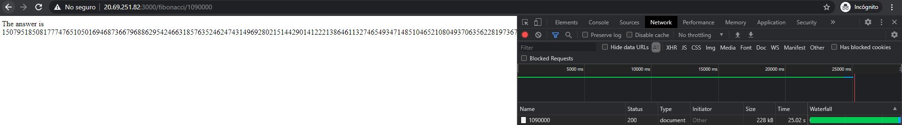

Consumo de CPU con Escalamiento Vertical del punto 7:
Se puede evidenciar la disminución aproximadamente de la mitad del consumo de la CPU en la VM.
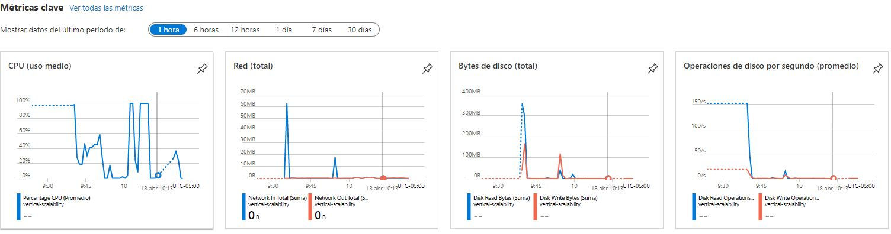

Carga Concurrente (Punto 9) con Escalamiento Vertical:
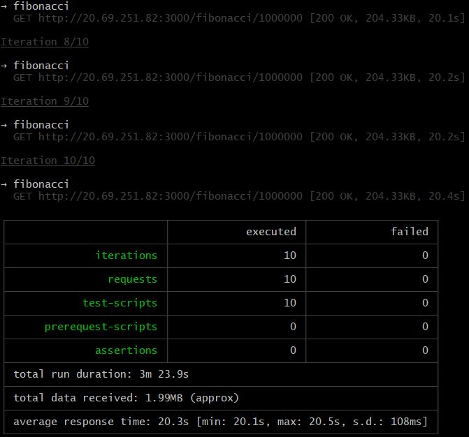

Consumo de CPU de Carga Concurrente con Escalamiento Vertical:
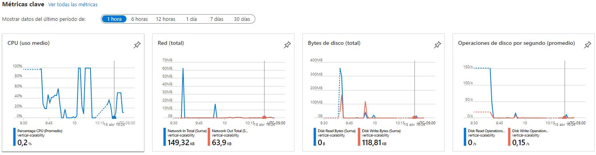

12. Evalue el escenario de calidad asociado al requerimiento no funcional de escalabilidad y concluya si usando este
    modelo de escalabilidad logramos cumplirlo.

Ya que el consumo de la CPU en los casos de prueba no pasa del 50% se puede decir que la calidad se logra cumplir ya que
no sobrepasa el 70% con el escalamiento vertical aunque para solucionarlo deberiamos incurrir en gastos que son casi 20
veces de lo que era el costo sin el escalamiento vertical.

13. Vuelva a dejar la VM en el tamaño inicial para evitar cobros adicionales.

**Preguntas**

1. ¿Cuántos y cuáles recursos crea Azure junto con la VM?

Se crean 7 recursos mostrados en la imagen.   
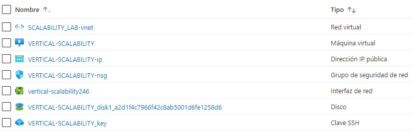

2. ¿Brevemente describa para qué sirve cada recurso?
   
* Red virtual: Crea una red privada en la nube.

* Máquina virtual: Este recurso es el que contiene la maquina virtual.

* Dirección IP pública: Gracias a este recurso se tiene una dirección IP pública para acceder a la VM.

* Grupo de seguridad de red: Contiene las reglas de seguridad de entrada y salida describiendo los puertos en cada caso.

* Interfaz de red: Este recurso permite que la VM se comunique con los recursos de Internet, Azure y locales.

* Disco: Este define la capacidad de almacenamiento en la nube.

* Clave SSH: Este recurso administra el acceso a la VM mediante SSH con clave pública y privada.

3. ¿Al cerrar la conexión ssh con la VM, por qué se cae la aplicación que ejecutamos con el
   comando `npm FibonacciApp.js`? ¿Por qué debemos crear un *Inbound port rule* antes de acceder al servicio?
   
Al cerrar la conexión ssh se finalizan las tareas en curso y por esto debemos usar forever el cual permite mantener activas las aplicaciones y volverlas a cargar sin ningún tiempo de inactividad.

Debemos crear un *Inbound port rule* antes de acceder al servicio, ya que esto define como dice su nombre las reglas de entrada al recurso, aquí se definen las reglas de tráfico de entrada que se aplican en la instancia.

4. Adjunte tabla de tiempos e interprete por qué la función tarda tanto tiempo.

En los tiempos que se observan en la parte 1 se puede ver que hace siempre el proceso iterativo del cálculo de Fibonacci y no hace memorización para implementar un caché.

5. Adjunte imágen del consumo de CPU de la VM e interprete por qué la función consume esa cantidad de CPU.
   
La imagen se adjunto anteriormente y evidencia el proceso iterativo de búsqueda del Fibonacci del numero a evaluar.

6. Adjunte la imagen del resumen de la ejecución de Postman. Interprete:
    * Tiempos de ejecución de cada petición.
        
        Los tiempos fueron adjuntos anteriormente, los tiempos varian ya que al poner solo 2 procesos concurrentes cambia de 24 segundos en promedio a 49 segundos, y el tiempo total cambia de 3 minutos a 5 minutos.    
    
    * Si hubo fallos documentelos y explique.
    
        Se ve constantemente un error read ECONNRESET lo cual significa que algunas conexiones se queden colgadas o no se complete correctamente.

7. ¿Cuál es la diferencia entre los tamaños `B2ms` y `B1ls` (no solo busque especificaciones de infraestructura)?

Para ver las diferencias entre los dos tamaños se presenta una tabla explicativa:

| Tamaño | vCPU | GiB | SSD | Rendimiento base CPU | Rendimiento max CPU | Discos de datos max.| IOPS/Mbps| NIC|
|--------|------|-----|-----|----------------------|---------------------|--------------------|-----------|----|
| B1ls   | 1    | 0.5 | 4   | 5%                   | 100%                | 2                 |  200/10    | 2  |
| B2ms   | 2    | 8   | 16  | 60%                  | 200%                | 4                 |  2400/22.5 | 3  |

8. ¿Aumentar el tamaño de la VM es una buena solución en este escenario?, ¿Qué pasa con la FibonacciApp cuando cambiamos
   el tamaño de la VM?
   
Es una buena solución para bajar el rendimiento de la CPU pero no para disminuir tiempos ya que es muy poca la diferencia entre los dos casos de prueba.

9. ¿Qué pasa con la infraestructura cuando cambia el tamaño de la VM? ¿Qué efectos negativos implica?
   
Si el rendimiento de la CPU en el momento lo tienen muy alto y bajan el tamaño de la VM puede saturar la maquina muy rapido.
En el caso contrario que este usando muy poca CPU no se justifica incrementar el tamaño ya que incurre en gastos mas altos.

10. ¿Hubo mejora en el consumo de CPU o en los tiempos de respuesta? Si/No ¿Por qué?
    
En el consumo de CPU si hubo una mejoria notable ya que el uso medio de este disminuyo aproximadamente la mitad, pero los tiempos no tuvieron una variación muy notable ya que el programa tiene que hacer siempre un ciclo nuevo por cada consulta.

11. Aumente la cantidad de ejecuciones paralelas del comando de postman a `4`. ¿El comportamiento del sistema es
    porcentualmente mejor?
    
No, al tener 4 ejecuciones paralelas se tarda en recibir respuesta y envia un error.

### Parte 2 - Escalabilidad horizontal

#### Crear el Balanceador de Carga

Antes de continuar puede eliminar el grupo de recursos anterior para evitar gastos adicionales y realizar la actividad
en un grupo de recursos totalmente limpio.

1. El Balanceador de Carga es un recurso fundamental para habilitar la escalabilidad horizontal de nuestro sistema, por
   eso en este paso cree un balanceador de carga dentro de Azure tal cual como se muestra en la imágen adjunta.


2. A continuación cree un *Backend Pool*, guiese con la siguiente imágen.


3. A continuación cree un *Health Probe*, guiese con la siguiente imágen.


4. A continuación cree un *Load Balancing Rule*, guiese con la siguiente imágen.


5. Cree una *Virtual Network* dentro del grupo de recursos, guiese con la siguiente imágen.


#### Crear las maquinas virtuales (Nodos)

Ahora vamos a crear 3 VMs (VM1, VM2 y VM3) con direcciones IP públicas standar en 3 diferentes zonas de disponibilidad.
Después las agregaremos al balanceador de carga.

1. En la configuración básica de la VM guíese por la siguiente imágen. Es importante que se fije en la "Avaiability
   Zone", donde la VM1 será 1, la VM2 será 2 y la VM3 será 3.


2. En la configuración de networking, verifique que se ha seleccionado la *Virtual Network*  y la *Subnet* creadas
   anteriormente. Adicionalmente asigne una IP pública y no olvide habilitar la redundancia de zona.


3. Para el Network Security Group seleccione "avanzado" y realice la siguiente configuración. No olvide crear un *
   Inbound Rule*, en el cual habilite el tráfico por el puerto 3000. Cuando cree la VM2 y la VM3, no necesita volver a
   crear el *Network Security Group*, sino que puede seleccionar el anteriormente creado.


4. Ahora asignaremos esta VM a nuestro balanceador de carga, para ello siga la configuración de la siguiente imágen.


5. Finalmente debemos instalar la aplicación de Fibonacci en la VM. para ello puede ejecutar el conjunto de los
   siguientes comandos, cambiando el nombre de la VM por el correcto

```
git clone https://github.com/daprieto1/ARSW_LOAD-BALANCING_AZURE.git

curl -o- https://raw.githubusercontent.com/creationix/nvm/v0.34.0/install.sh | bash
source /home/vm1/.bashrc
nvm install node

cd ARSW_LOAD-BALANCING_AZURE/FibonacciApp
npm install

npm install forever -g
forever start FibonacciApp.js
```

Realice este proceso para las 3 VMs, por ahora lo haremos a mano una por una, sin embargo es importante que usted sepa
que existen herramientas para aumatizar este proceso, entre ellas encontramos Azure Resource Manager, OsDisk Images,
Terraform con Vagrant y Paker, Puppet, Ansible entre otras.

#### Probar el resultado final de nuestra infraestructura

1. Porsupuesto el endpoint de acceso a nuestro sistema será la IP pública del balanceador de carga, primero verifiquemos
   que los servicios básicos están funcionando, consuma los siguientes recursos:

```
http://52.155.223.248/
http://52.155.223.248/fibonacci/1
```

2. Realice las pruebas de carga con `newman` que se realizaron en la parte 1 y haga un informe comparativo donde
   contraste: tiempos de respuesta, cantidad de peticiones respondidas con éxito, costos de las 2 infraestrucruras, es
   decir, la que desarrollamos con balanceo de carga horizontal y la que se hizo con una maquina virtual escalada.

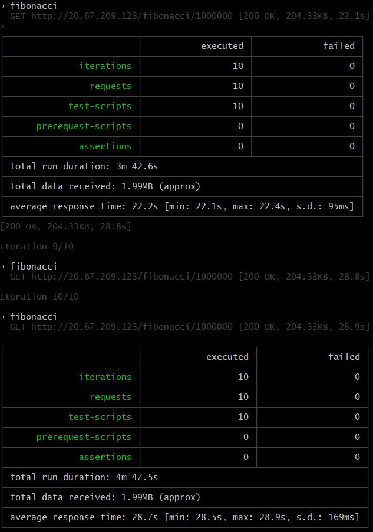

Se evidencia la diferencia entre los resultados de la parte 1 y este resultado ya que se tienen resultados como los siguientes:

| Tipo | Request | Failed | promedio duración total | promedio tiempo de respuesta |
|------|---------|--------|-------------------------|------------------------------|
| Escalamiento vertical| 20 | 8| 5m 24.5s | 41.4s|
| Escalamiento horizontal| 20 | 0| 3m 95s| 25.5s|

3. Agregue una 4 maquina virtual y realice las pruebas de newman, pero esta vez no lance 2 peticiones en paralelo, sino
   que incrementelo a 4. Haga un informe donde presente el comportamiento de la CPU de las 4 VM y explique porque la
   tasa de éxito de las peticiones aumento con este estilo de escalabilidad.

```
newman run ARSW_LOAD-BALANCING_AZURE.postman_collection.json -e [ARSW_LOAD-BALANCING_AZURE].postman_environment.json -n 10 &
newman run ARSW_LOAD-BALANCING_AZURE.postman_collection.json -e [ARSW_LOAD-BALANCING_AZURE].postman_environment.json -n 10 &
newman run ARSW_LOAD-BALANCING_AZURE.postman_collection.json -e [ARSW_LOAD-BALANCING_AZURE].postman_environment.json -n 10 &
newman run ARSW_LOAD-BALANCING_AZURE.postman_collection.json -e [ARSW_LOAD-BALANCING_AZURE].postman_environment.json -n 10
```

Ya que la Zona de disponibilidad tiene solo valores de 1 a 3 y no se crea la cuarta petición en paralelo generando errores por timeout.

**Preguntas**

* ¿Cuáles son los tipos de balanceadores de carga en Azure y en qué se diferencian?, ¿Qué es SKU, qué tipos hay y en qué
  se diferencian?, ¿Por qué el balanceador de carga necesita una IP pública?

Los balanceadores en azure se pueden configurar de dos tipos, como balanceador público o interno. El público tendra una IP pública en el frontend en la que recibirá peticiones que repartira en las maquinas del backend y el interno hara lo mismo pero no con una IP pública sino privada lo cual no la hace accesible desde intenet.

SKU sinifica Stock-keeping-Unit(Unidad de mantenimiento de existencias) basicamente significa un articulo que esta en oferta. Además los balanceadores existen de dos tipos, basico y estandard los cuales se diferencian por su soporte, precio, protocolos disponibles y configuraciones avanzadas.

El balanceador de carga necesita una IP publica para poder recibir peticiones en el frontend desde internet y no solo privadamente.


* ¿Cuál es el propósito del *Backend Pool*?

El proposito del Backend Pool(grupo de backend) es un componente critico del balanceador de carga. El grupo de backend define el grupo de recursos que brindarán tráfico para una regla de equilibrio de carga determinada.

* ¿Cuál es el propósito del *Health Probe*?
  
El proposito del Health Probe es detectar el estado del punto de conexión del backend, esta determina que instancias del grupo de backend recibirán nuevos flujos.

* ¿Cuál es el propósito de la *Load Balancing Rule*? ¿Qué tipos de sesión persistente existen, por qué esto es
  importante y cómo puede afectar la escalabilidad del sistema?.

El balanceador de carga distribuye los flujos entrantes que llegan al frontend del balanceador a las instanceas de backend. Estos flujos están de acuerdo con las reglas de equilibrio de carga(Load Balancing Rule) y las sondas de estado (Health Probe). En esta se define que version del protoloco IP se usara (IPv4 o IPv6), la IP del frontend, el protocolo de conexión usado (TPC o UPD), el puerto en el que correra (por defecto el 80), El puerto del backend, se define el backend pool y el health probe.

Existen 3 tipos de sesión persistente:

    * None(hash-based): Especifica que las solicitudes sucesivas del mismo cliente pueden ser manejadas por cualquier máquina virtual.
    * Client IP (source IP affinity two-tuple): Especifica que las solicitudes sucesivas de la misma dirección IP de cliente serán manejadas por la misma máquina virtual.
    * Client IP and protocol (source IP affinity three-tuple): Especifica que las solicitudes sucesivas de la misma combinación de protocolo y dirección IP de cliente serán manejadas por la misma máquina virtual. 

Esto es importante ya que se puede sobrecargar una maquina virtual si se configura mal mientras que las otras maquina esten libres.

* ¿Qué es una *Virtual Network*? ¿Qué es una *Subnet*? ¿Para qué sirven los *address space* y *address range*?
  
La red virutal(Virtual Network) crea una red privada en la nube conectando asi servicios y recursos.

La subnet es una subred en la cual se van a tener unos recursos definidos dentro de la red.

La address space especifica las IP que podran ser usadas y el address range sirve para añadir una subred a esa red principal.

* ¿Qué son las *Availability Zone* y por qué seleccionamos 3 diferentes zonas?. ¿Qué significa que una IP sea *zone-redundant*?
  
Las Availability Zone son zonas de alta disponibilidad, estas estan disponibles sin coprometer la residencia de datos, se puede acceder a estos incluso en caso de errores en el centro de datos principal, ademas satisface necesidades de alta disponibilidad y respalda la copia de seguridad. 

Una IP zone-redundant es una IP que esta replicada en varias zonas de disponibilidad.

* ¿Cuál es el propósito del *Network Security Group*?

Un grupo de seguridad de red contiene reglas de seguridad que permiten o deniegan el tráfico de red entrante o el tráfico de red saliente de varios tipos de recursos de Azure.

* Informe de newman 1 (Punto 2)
* Presente el Diagrama de Despliegue de la solución.